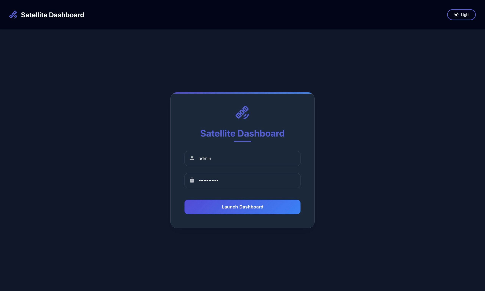
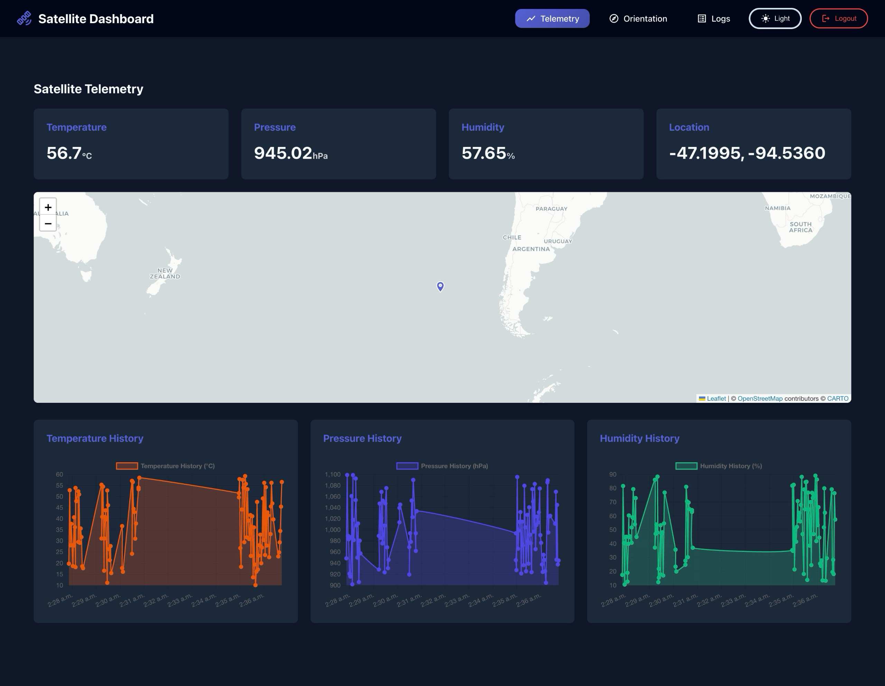
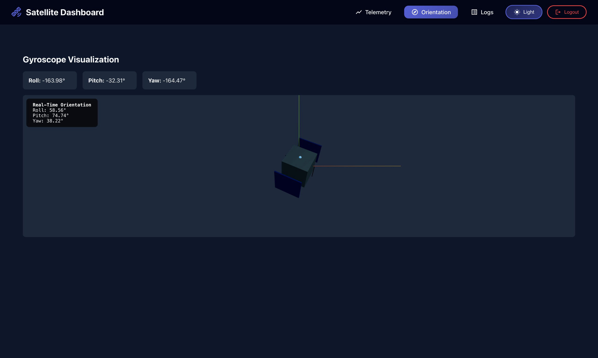
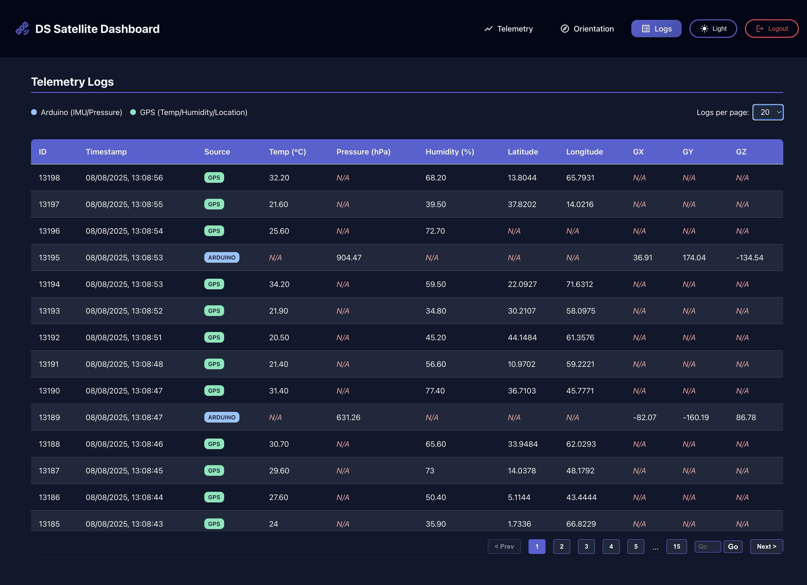

# Satellite Dashboard

A full-stack web application for visualizing and monitoring satellite telemetry data from multiple sensor sources.

## Project Structure

- *backend/*: Flask API for telemetry and gyro data
- *frontend/*: React dashboard for visualization

---

## Environment Variables

Before running the backend, copy the example environment file and edit it as needed:

bash
cd backend
cp .env.example .env

- Edit .env to set your configuration (see comments in the file)

   - SERVER_BASE_URL: Base URL for both simulators. If not set, defaults to http://localhost:5000.
     - ard.py sends data to: {SERVER_BASE_URL}/data
     - rasp.py sends data to: {SERVER_BASE_URL}/upload
   - ADMIN_USERNAME, ADMIN_PASSWORD_HASH: Set admin credentials for login.

See backend/.env.example for details and instructions.

---

## Backend (Flask API)

### Setup

1. Navigate to the backend directory:
   bash
   cd backend
   
2. (Optional) Create a virtual environment:
   bash
   python3 -m venv ../venv
   source ../venv/bin/activate
   
3. Install dependencies:
   bash
   pip install -r requirements.txt
   

### Running the API

bash
python app.py

- The API will be available at http://localhost:5000.
- Endpoints:
  - /data — *POST* endpoint to receive LoRa telemetry data (from Arduino/device or ard.py simulator)
  - /upload — *POST* endpoint to receive WiFi sensor data (from Raspberry Pi/device or rasp.py simulator)
  - /api/telemetry — Get latest telemetry data (for frontend)
  - /api/logs — Retrieve last 300 telemetry logs with source information
  - /api/gyro — Get latest gyro data
  - /api/login — Admin login

---

**Example: /data POST request (LoRa/Arduino data)**

- *Endpoint:* /data
- *Method:* POST
- *Content-Type:* application/json
- *Body:*
  json
  {
    "data": "T:25.00C, P:1013.25hPa, AX:0.01, AY:-0.02, AZ:0.98, GX:12.34, GY:-56.78, GZ:90.12, MX:0.12, MY:-0.34, MZ:0.56"
  }
  
- The data string must match the format above (identical to what the Arduino or ard.py simulator sends).
- Extracts: pressure, gyro data (GX, GY, GZ)
- Source: "arduino"

**Example: /upload POST request (WiFi/GPS sensor data)**

- *Endpoint:* /upload
- *Method:* POST
- *Content-Type:* application/json
- *Body:*
  json
  {
    "temperature": 25.5,
    "humidity": 65.2,
    "latitude": 40.7128,
    "longitude": -74.0060,
    "timestamp": "2024-01-15T10:30:00"
  }
  
- Extracts: temperature, humidity, GPS coordinates
- Source: "GPS"
- Supports null values for sensor failures

---

## Sending Telemetry Data to the Backend

After starting the backend, you have multiple options for sending telemetry data:

### 1. Real Devices
- *LoRa/Arduino Device*: Send data in the correct format to http://<backend-ip>:5000/data
- *WiFi/GPS Device*: Send JSON data to http://<backend-ip>:5000/upload

### 2. Simulate Arduino Data (LoRa Simulator)
- If you do *not* have a real LoRa/Arduino device, you can simulate data by running the provided Python script in a separate terminal:

   1. Open a new terminal and navigate to the backend directory:
      bash
      cd backend
      
   2. (Optional) Set the SERVER_BASE_URL environment variable if your backend is not running on the default URL:
      bash
      export SERVER_BASE_URL="http://localhost:5000"
      
      Or, set it in a .env file in the backend directory. The simulator will automatically use .env if present.
      
      If the primary server is unreachable, the simulator will automatically attempt to send data to the fallback server at http://localhost:5000/data.
   3. Run the simulator:
      bash
      python ard.py
      

### 3. Simulate WiFi/GPS Sensor Data (Raspberry Pi Simulator)
- If you do *not* have a real WiFi/GPS sensor device, you can simulate data using the new Raspberry Pi simulator:

   1. Open a new terminal and navigate to the backend directory:
      bash
      cd backend
      
   2. (Optional) Set the SERVER_BASE_URL environment variable if your backend is not running on the default URL:
      bash
      export SERVER_BASE_URL="http://localhost:5000"
      
      Or, set it in a .env file in the backend directory. The simulator will automatically use .env if present.
      
      If the primary server is unreachable, the simulator will automatically attempt to send data to the fallback server at http://localhost:5000/upload.
   3. Run the simulator:
      bash
      python rasp.py
      

- The simulators will continuously generate random telemetry data and POST it to the backend, which stores it in the database with source identification. The frontend will then display this data as if it were coming from real devices.

- *ard.py* simulates LoRa/Arduino data (pressure, gyro) and sends to /data endpoint
- *rasp.py* simulates WiFi/GPS sensor data (temperature, humidity, location) and sends to /upload endpoint
- Both simulators provide improved error handling, logging, and automatic fallback mechanisms.
- *ard.py* fallback: http://localhost:5000/data
- *rasp.py* fallback: http://localhost:5000/upload

---

## Frontend (React App)

### Setup

1. Navigate to the frontend directory:
   bash
   cd frontend
   
2. Install dependencies:
   bash
   npm install
   

### Running the App

bash
npm start

- The app will be available at http://localhost:3000.
- The frontend expects the backend API to be running on port 5000.

---

## Development Notes

- The backend uses SQLite (telemetry.db) and stores all incoming telemetry data with source identification.
- *Database Schema*: Updated to include a source column to distinguish between "arduino" (LoRa) and "GPS" (WiFi) data sources.
- *ard.py* simulates Arduino by sending random pressure and gyro data to /data endpoint.
- *rasp.py* simulates Raspberry Pi/WiFi sensors by sending random temperature, humidity, and GPS data to /upload endpoint.
- Both simulators support .env configuration, automatic fallback mechanisms, and improved error handling/logging.
- The frontend is built with React, Three.js, Chart.js, and Leaflet.
- See frontend/package.json for all dependencies.

---

## Screenshots

### Login
Auth gate with secure hash checks

### Telemetry Dashboard
Live Chart.js plots & real-time location

### 3D CubeSat
Three.js model with live roll, pitch, yaw

### Logs
Telemetry history snapshots in a table with source information

---
## License

MIT